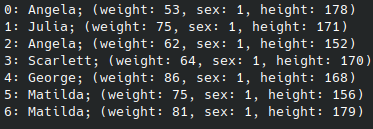
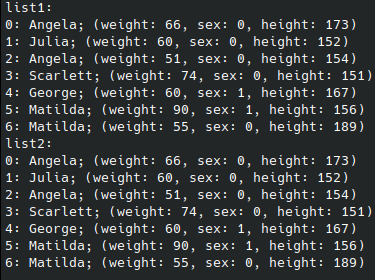
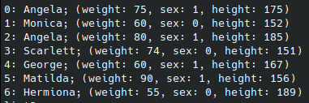
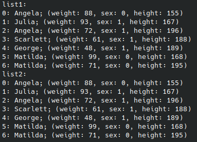

# Singly Linked List
 This is an implementation of the Singly Linked List. In this file, there is described how you can use this implementation. The content of this fiile is basically the same as content of the [main.cpp file](main.cpp). In both (this and main.cpp) files there is explained how to use this implementation, here in simple text, in main.cpp in comments. If you prefer to read code instead of README.md file, you can just read function 'show_functionality' which is in main.cpp file. You will know just as much, as after reading this file.

  For purpuse of this tutorial I created a simple class called Person. In this tutorial I will create a SLL (Singly Linked List) which keys wille be of type String and values of type Person. Then I will play with this list, so you can see how to use it. This is class person:
~~~ c++
class Person {
public:

    int weight;
    bool sex; // true for woman, false for man
    int height;
    Person(int weight, bool sex, int height) : weight(weight), sex(sex), height(height) {
    }

    Person() : Person(rand() % 60 + 40, rand() % 2 == 0, rand() % 50 + 150) {
        //creates a ranom person.
    }
    friend std::ostream& operator<<(std::ostream& stream, const Person & my_person){
        stream << "(weight: " << my_person.weight << ", sex: " << my_person.sex << ", height: " << my_person.height << ")";
        return stream;
    }
};
~~~
I also created a function `print_people_list(const SLL<std::string, Person> & list)` which prints the list of people. (It prints the SLL with keys of type String and values of type Person.)  
### Creating an empty list.
This is how you can create an empy list:
~~~ c++
SLL <std::string, Person> list1;
~~~  
 

### Inserting new elements.
You can use method "insert_front" to insert new element to the front of the list. First argument of this function is key, second is value.
~~~
list1.insert_front("George", Person());
~~~
This is how the list look now: 
 
You can use method "insert_back" to insert elements at the end of the list. Belowe code adds two elements to the front of the list and the back of the list.
~~~ c++
list1.insert_front("Angela", Person());
list1.insert_front("Angela", Person());
list1.insert_back("Matilda", Person());
list1.insert_back("Matilda", Person());
~~~
This is how the list look now: 
 
You can use method "insert_after" to insert new element aftet an element of specified key. In the list there can be multiple elements of the same key, that's why method "insert_after" has argument "int occurrence". The method inserts new node after n-th node which key is same as 'after' argument, where n is 'occurence' argument. The default value of "occurence" argument is 1. Below code will insert two elements of keys Julia and Scarlett after first and second element of key "Angela".
~~~ c++
list1.insert_after("Julia", Person(), "Angela", 1);
list1.insert_after("Scarlett", Person(), "Angela", 2);
~~~
This is how the list look now: 

  

### Making copy of a list.
You can use copy constructor to make a deep copy of the list.
~~~ c++
const SLL<std::string, Person> list2 = list1;
~~~
This is how the both lists look now: 
 
(Now modyfying list1 will not alter list1 and vice versa.)
  

### Accessing list elements.
To access the list elements you can use "get_first", "get_last" and "get_value" methods. First one returns value of the first element, second method returns value of the last element, third method returns value of the n'th element of specified key. (n i is value of second argument, default 1).
~~~ c++
Person my_person = list2.get_first();
std::cout << "first person:"<<my_person << std::endl;
my_person = list2.get_last();
std::cout << "last person:" << my_person << std::endl;
my_person = list2.get_value("Matilda");
std::cout << "First person got by key 'Matilda':" << my_person << std::endl;
my_person = list2.get_value("Matilda", 2);
std::cout << "Second person got by key 'Matilda':" << my_person << std::endl;
~~~
This is output of above code: 

  

### Modyfying list elements.
You can access values of both const and non-const list, but you can modify only elements of non-const list.
You can modify keys and values of a non-const list by using methods "set/_value" and "set_key".  First method set value of the n'th element of specified key, second method sets key of the n'th element of specified key. (n i is value of last argument "occurnce", default 1). Below code will change the value of first and second element of key "Angela" and change key of second "Matilda" to "Hermiona" and first "Julia" to "Monica".
~~~ c++
list1.set_value("Angela", Person(75, 1, 175));
list1.set_value("Angela", Person(80, 1, 185), 2);
list1.set_key("Matilda", "Hermiona", 2);
list1.set_key("Julia", "Monica");
~~~
This is how list1 looks now: 

  

### Deleting list elements.
You can use "delete_first" and "delete_last" methods to delete the first and last elements of the list. You can also use method "delete_element" to delete element of specified key. Method "delete_element"  deletes the n-th node of key given by 'key' argument, where n is 'occurence' argument.
~~~ c++
list1.delete_element("Angela", 2);
list1.delete_first();
list1.delete_last();
~~~
This is how list1 looks now: 

  

### Intarators.
I will now copy (deeply) list2 into list1.
~~~ c++
list1 = list2;
// list1 is of type  SLL<std::string, Person> (non-const)
// list2 is of type  const SLL<std::string, Person>
~~~
Here is how both list1 and list2 look now: 
 
A "begin" method will return the iterator pointing to the first element. Calling "begin" on non-const list returns an iterator which enables both to access and modify elements, while callling "begin" returns an iterator which enables only to access elements. To be more precise calling "begin" on non-const list returns object of class IteratorVar, while calling "begin" on const list returns object of class IteratorConst. 
You can increment or decrement the iterator to go to next or previous node. Incrementing an iterator pointing to the last element results in nullptr, decrementing an iterator pointing to the first element results in nullptr. 
For both classes (IteratorVar and IteratorConst) indirection operators (*) are implemented but they do different things. Operator * from IteratorVar returns a pair (std::pair) of references to key and value of node pointed by the itarator. This way you can acces and also modify values. Operator * from IteratorConst returns a pair (std::pair) of copy of key and value of node pointed by the itarator. This way you can only acces key and values, you can't change them. 
Below code shows how to use iterators to print all people heigher than 170.
~~~ c++
int i = 0;
    for (auto my_iterator = list2.begin(); my_iterator != nullptr; ++my_iterator, ++i) {
        std::pair<std::string, Person> my_pair = *my_iterator;
        if(my_pair.second.height>170)
            std::cout << i << ": " << my_pair.first << "; " << my_pair.second << std::endl;
    }
~~~
This is output of above code: 

 Below code shows how to use iterators to set all keys starting with letter 'A' to "Afrodyta" and set height of all people heigher than 170 to 200.
~~~ c++
for (auto my_iterator = list1.begin(); my_iterator != nullptr; ++my_iterator) {
        std::pair<std::string &, Person &> my_pair = *my_iterator;
        if (my_pair.first[0] == 'A')
            my_pair.first = "Afrodyta";

        if (my_pair.second.height > 175)
            my_pair.second.height = 200;
    }

std::cout << "list1:" << std::endl;
print_people_list(list1);
~~~
This is output of above code: 

  
### Inserting new elements.
Here is how you can clear the list:
~~~ c++
list1.clear();
~~~
And now list is empty.

